<div align="center">



<br /><br />

**Plan, track, and deliver projects with intelligent milestone generation.**

<br />

   

<br /><br />

**Part of the [InfoDot Ecosystem](https://github.com/sakhileb/InfoDot)** &nbsp;·&nbsp; `projects.infodot.app`

</div>

---

## What is Dot.Projects?

Dot.Projects is the project management platform in the InfoDot ecosystem. AI-powered milestone generation turns a project brief into a structured plan instantly; a drag-and-drop kanban board and Gantt timeline keep teams moving toward delivery with full visibility.

## Core Features

- AI milestone generation — input a brief, get a full project plan
- Drag-and-drop kanban board with custom columns
- Gantt timeline view with dependency tracking
- Task assignment, due dates, and priority levels
- Project health dashboard — velocity, burndown, and blockers
- Team collaboration — comments, mentions, and file attachments
- Time logging per task linked to billing
- Ecosystem SSO from InfoDot hub

## Domain Models

- **Project** — scoped initiative with status
- **Milestone** — key delivery checkpoint
- **Task** — work item with assignee and status
- **TaskComment** — discussion thread per task

## Tech Stack

| Layer | Technology |
|---|---|
| Framework | Laravel 12 |
| Language | PHP 8.4 |
| Frontend | Livewire 3 · Alpine.js 3 · Tailwind CSS |
| Database | PostgreSQL 16 (shared across ecosystem) |
| Realtime | Laravel Reverb |
| Auth | Laravel Sanctum (InfoDot SSO) |
| AI | Anthropic Claude (`claude-sonnet-4-6`) |
| Storage | AWS S3 / Local (Flysystem) |
| Search | Laravel Scout · Meilisearch |
| Queue | Redis · Laravel Horizon |

## Quick Start

```bash
git clone https://github.com/sakhileb/Dot.Projects.git
cd Dot.Projects
cp .env.example .env
composer install
npm install && npm run build
php artisan key:generate
php artisan migrate
php artisan serve
```

> **Ecosystem SSO:** Set `DB_*` env vars to the shared InfoDot PostgreSQL instance and `APP_URL=https://projects.infodot.app`. Users authenticated through InfoDot gain access automatically via Sanctum handoff tokens.

## Ecosystem

**Dot.Projects** is one of **21 platforms** in the InfoDot ecosystem, connected via shared PostgreSQL and Sanctum SSO. Visit [InfoDot](https://github.com/sakhileb/InfoDot) to explore the full platform map.

## License

MIT © [SK Digital / BluPin Incorporated](https://github.com/sakhileb)
